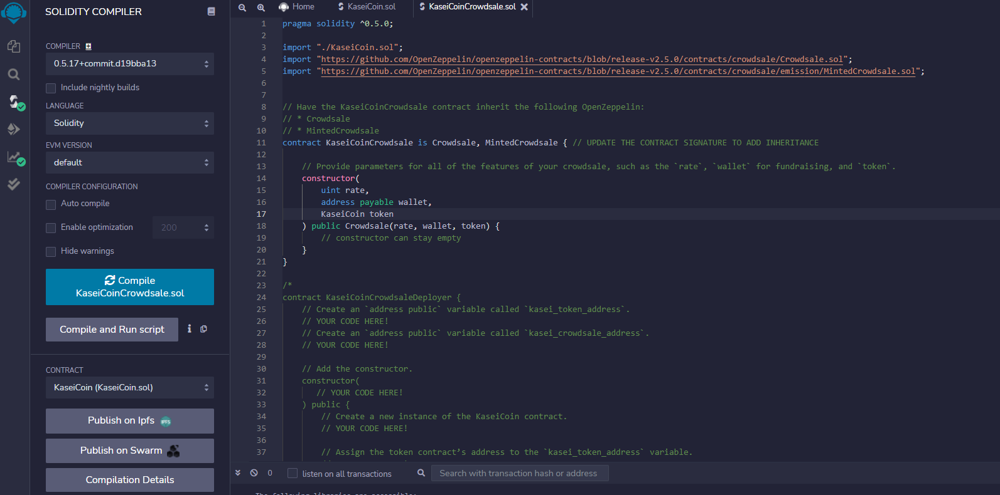
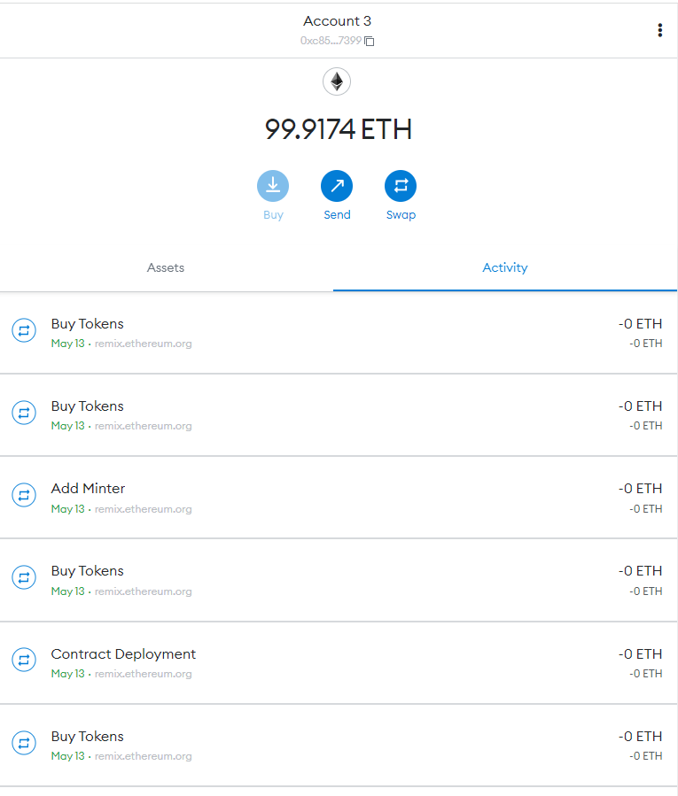

# KaseiCoin
To build a fungible token KaseiCoin that is ERC-20 compliant. This project will allow people who are moving to Mars to convert their earthling money to KaseiCoin.


The steps for this project are divided into the following sections:

1. Create the KaseiCoin token contract
2. Create the KaseiCoin crowdsale contract
3. Create the KaseiCoin deployer contract
4. Perform a real-world, pre-production test of your crowdsale. In order to do so, we will deploy the crowdsale to a local blockchain by using Remix, MetaMask, and Ganache


---

## Technologies

We will use [Remix IDE website](https://remix.ethereum.org/#optimize=false&runs=200&evmVersion=null&version=soljson-v0.8.7+commit.e28d00a7.js) to build and test smart contracts. We will also need to install [Metamask](https://metamask.io/) and [Ganache](https://trufflesuite.com/ganache/) in order to deploy this project.

---

## Usage

You will need to clone the repo so that you can run the application:

```
https://github.com/locthai2002/KaseiCoin.git

```

Here are some screenshots from running the application:

## Create the KaseiCoin token contract


## Create the KaseiCoin crowdsale contract



## Create the KaseiCoin deployer contract


## Real-world Demo

### Ganache


### Metamask


### Ganache updated after deployed


### Deployed and Run Transaction


### Deployed and Run Transaction, Ganache, and Metamask


## Other transactions





---

## Contributors

Loc Thai -- www.linkedin.com/in/loc-thai-69b8a2141
Phone: 415.400.9998

---

## License

MIT
